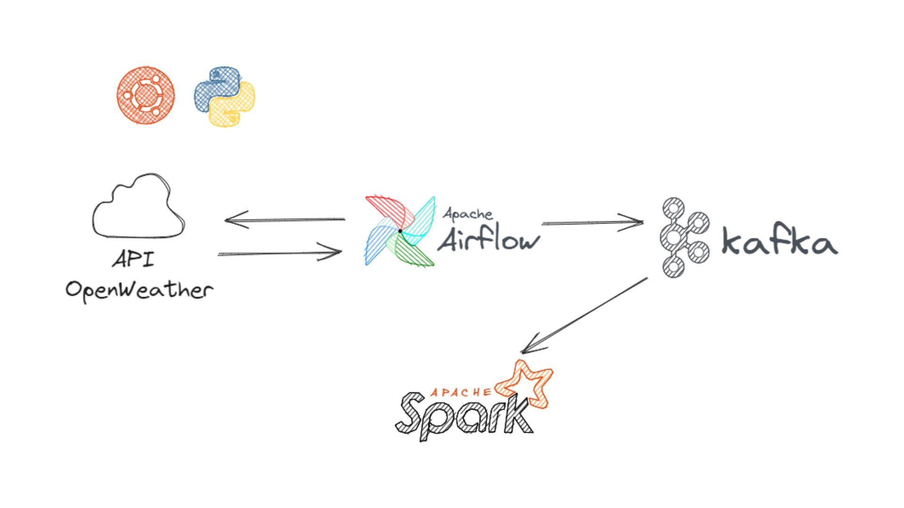

# Construcción de un pipeline con apache AIRFLOW, KAFKA y SPARK usando PYTHON

Bienvenido a la guia de proyecto de un pipeline. En este repositorio, exploramos las principales herramientas y tecnologías utilizadas para automatizar flujos de datos y procesar información en tiempo real.

## Video en YouTube
)

)

## Herramientas Clave
Este proyecto se basa en las siguientes herramientas y tecnologías:

- 
- 
- 
- 

## Requisitos
Puedes encontrar los requisitos necesarios para ejecutar este proyecto en el archivo `requirements.txt`.

## Contacto
Si tienes alguna pregunta o sugerencia, no dudes en contactarme:
- LinkedIn: 
- Correo Electrónico: [brrsanchezfi@gmail.com](mailto:brrsanchezfi@gmail.com)

¡Gracias por visitar mi repositorio y explorar este proyecto de ingeniería de datos!

